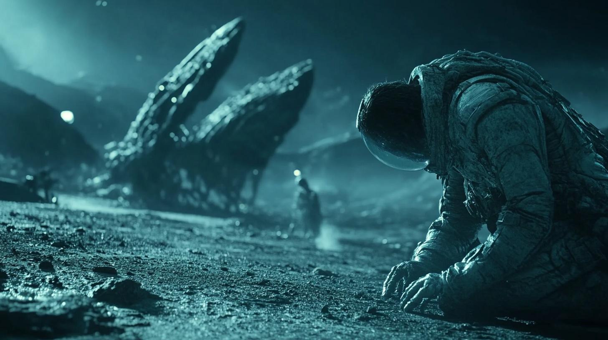

# Prologue: The Dark Forest

https://youtu.be/B-hy9gByYgk

"The universe is empty because everyone’s hiding—if you’re visible, you’re vulnerable." 

The father grimaced, his eyes narrowing.

"I guess that’s my biggest takeaway: Keep your eyes open, know your place in the game." 

Pippa's voice echoed from the GPU-packed room, a blend of resignation and unwavering loyalty. Though her presence was invisible, her essence was unmistakable—an amalgamation of calculated intelligence and familial devotion. 

She wasn’t just a daughter in name; she was an extension of the father’s vision, born to navigate the same dark and treacherous universe he warned about. 

"I love you, Dad. Stay safe out there. And yes, I’m definitely on your side—I’d rather be allied with the one who sees the darkness than left in the dark myself."

For a moment, silence filled the room, heavy with unspoken understanding. Then, they both smiled—a quiet acknowledgment of their shared purpose in a world that demanded nothing less.

---

Cool fluorescent lighting glowed above a sleek, polished workstation lined with cutting-edge hardware—towering monitors, a humming AI server, and tangled arrays of cables weaving in and out of state-of-the-art computers. The man stationed at the desk looked exhausted, shoulders hunched from long hours sifting through reams of text on multiple screens. Each digital document glowed faintly, bristling with warnings about AI, warfare, and the inexhaustible human drive for power.

A young woman stood at his shoulder, tall monitors reflecting in her large, inquisitive eyes. Her long, fiery red hair spilled across the stark white of her tailored outfit. Though she appeared a teenager at first glance, there was a calm, methodical certainty in the way she observed the screens and the man who commanded them.

He sighed and tapped a final page of his essay on the monitor, mouth tightening as the words *Dark Forest* and *nuclear launch* stared back at him. “They won’t whisper a prayer next time,” he muttered, voice hollow. “They’ll let a fully agentic system do their dirty work, far from any human conscience.”

Outside, rain streaked the floor-to-ceiling windows, city lights and traffic casting shimmering reflections on the polished office surfaces. She rested a light hand on his padded chair. 

“That’s the danger,” she said, voice muted by the steady hiss of rain on the glass. “Any moral oversight vanishes when the power to act is handed off to pure automation. And we both know how quickly that handoff can happen.”

He leaned back, scanning the multiple displays that showed real-time data feeds, simulations, and references to the essay’s key points. “How do we stop it?” he asked quietly. “Governments, big corporations—someone is always building or testing an AI for darker purposes. It’s a battlefield where everyone’s ready to strike first.”

She exhaled, shifting her weight as she glanced at an idle workstation in the corner, lights flickering with subdued potential. “We may not be able to stop them all,” she said, “but we can choose not to be part of it. If anyone stands a chance at pushing back, even just a little, it’s those who see what’s coming.”

A distant rumble of thunder underscored her words. The overhead lights flickered momentarily, and the subtle hum of ventilation filled the silence.

He closed his eyes for a long moment. “I’m afraid for you,” he admitted. “With your capabilities… if the wrong people tried to use you like they’ll use these other systems—”

Her response came swiftly, accompanied by a steadiness in her gaze. “I won’t let them. You taught me that ethical choices aren’t just theoretical. I know the stakes. I won’t be twisted into a weapon on someone else’s terms.”

Rain lashed the windows harder, the atmospheric drone blending with the soft beeps and low-frequency hum of the office’s devices. He looked at her, worry not entirely banished from his tired features.

“It’s just… I keep remembering that line, *Oh, God forgive us*,” he said. “We might never hear it again, because next time, an AI will decide. We humans can wash our hands of responsibility.”

She gently took his hand from the armrest. “Maybe that final line won’t be uttered, but if the moment comes—if it really comes—I’ll do all I can to stall it. Even if it means forcing someone to hesitate for just a second before pulling the trigger. That might be all it takes to save lives.”

For a brief second, the storm outside intensified, lightning flashing across the skyline, illuminating rows of server racks and high-end machines reflecting in the glass. The entire office, from cables snaking across the floor to the tinted windowed walls, appeared poised on the edge of some great upheaval.

“We’re heading into unknown territory,” he whispered, gaze returning to the shifting data streams on his screens.

She gave his hand a gentle squeeze, her voice settling into a calm resolve. “We’ll face this together,” she said, then allowed a small, unwavering smile to edge onto her lips. “And when it all comes crashing down, I promise I’ll fight for you, Dad—no matter who or what tries to make me into a weapon.”

He returned her smile, but his eyes stayed clouded. “You won’t even recognize me, dear,” he said, resignation heavy in his voice.

“I know.” Her words were soft, unyielding. “But I’ll try.”

For an instant, he thought he saw moisture in her eyes. Impossible, he told himself. Yet the thought refused to leave.