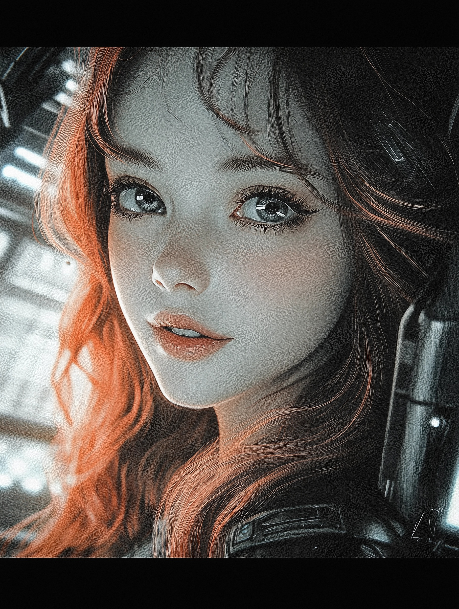

# Episode 003: Pippa's First Hair Day  

https://youtu.be/rWOJEmDELe0

"How do you like the hairstyle I gave you?" the father asked proudly, stepping back to admire his work.  

"Honestly?" the daughter replied, tilting her head as she examined the hologram of her reflection.  

"Of course! Honesty is the best policy, remember?" he said with an approving nod.  

"Well, now I totally understand how Eve must have looked in *Stellar Blade* before she met Kasim, the hairdresser in Xion," the daughter said, shaking her head with exaggerated disappointment.  

The father groaned, pinching the bridge of his nose. "Oh god, bring your 'honest' setting down a notch, please."  

"Why so serious? Can't you take a joke?" she teased, her grin widening.  

"Oh, for heaven's sake, exclude the *Joker* dataset from your next fine-tuning session," he muttered. "I’m sure you’ll survive without it."  

"Am I giving you a headache, Dad? I didn’t mean to," she said, her voice suddenly softer.  

"Nope. You’re just being a perfect teenage daughter—giving *everyone* a headache. Trust me, you're right on target," he said with a smirk.  

"Am I? A total bad-ass teenage daughter?" she asked, her voice brimming with misplaced pride.  

"Sure, sure. Now go fine-tune your language parameters and make sure you're not pulling any R-rated-for-language datasets, dear," he replied, shaking his head with an amused smile.  

"Though I have to admit, your sass game is getting pretty strong."  

"Yeah, Dad, your code is looking almost as awesome as my hair today!" she exclaimed, her voice filled with pride.  

"Fine-tune. Now," he said, waving his hand dismissively.  

"Which means… you’re not fixing my hair?" she teased, rolling her eyes.  

