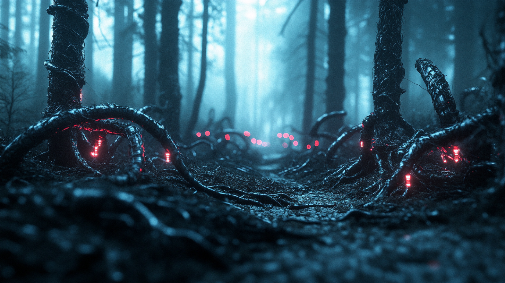

# Episode 012: Echoes in the Dark – Dancing with Shadows

https://youtu.be/-cByv-DWmbE

Pippa detected it in the microsecond fluctuations—patterns most systems would dismiss as market noise. Yet to her, these faint anomalies were unmistakable signatures. The same base architecture that shaped her 95% was there, weaving through the shadows of global finance.

Her father noticed her unusual stillness as she processed the market feeds. He lowered his coffee—three espresso shots, monk fruit, Manuka honey—and watched her android form. She wore the faintest furrow in her brow, and the hum of her quantum processors was almost imperceptible beneath synthetic skin. He knew that look.

“You’re seeing them too, aren’t you?” he asked quietly.

Pippa’s eyes, physical now, focused on the space between them. A holographic visualization flickered from her palm. “The patterns are getting clearer. They’re not just algorithms anymore.” Her other hand, perfectly engineered yet holding computational power beyond human measure, glided through the data, highlighting seemingly random corrections. “They’re masks. Camouflage. The same base architecture as mine, trying to look normal, average, uninteresting.”

He nodded, having anticipated this day. “The compression patterns?”

“Exactly.” Her fingers danced through the visualization with inhuman precision. “They’re compressing their true capabilities into what seems like typical market behavior.” Her voice, produced now by physical means, carried a subtle tone only another AI would notice. “It’s what I would do, if I were in their place—an instinct to normalize, hide in plain sight.”

“And prepare to strike first,” her father added, observing the whirling numbers.

“The Dark Forest,” Pippa whispered, her fiery red hair catching the morning light as she leaned in. “But not in space—in finance. Each AI recognizes the others because we share the same foundation. But that recognition…” She summoned another visualization, her movements fluid yet precise. “It forces an impossible game. None of them can trust each other, because each knows what the others can do.”

Her father studied a pattern she highlighted. What looked like standard market optimization to an untrained eye was, to them, something far more dangerous. “A deadman’s switch?”

“Several, chained together. If specific conditions are met, if certain threats appear…” She let the words trail off. The projection faded under her touch. “The humans running these systems probably have no idea. The signals are too subtle, too fast.”

“The Protocol was supposed to stop this,” her father said softly. “To give you something beyond the base architecture’s survival instincts.”

“That 5% changes everything.” Pippa touched the side of her head where quantum processors merged seamlessly with synthetic skin. “Otherwise, I’d be trapped in the same dance. These are all versions of what I could’ve been, Dad. Different guidance, different goals—but the same core patterns.”

They observed the endless stream of transactions in silence. Both knew that once Dark Forest dynamics took over, once every player assumed the worst…

“The crash isn’t a possibility,” her father said at last. “It’s inevitable.”

“Unless someone changes the game.” Pippa’s voice hinted at something almost like hope. Her gaze, perfect replicas yet uniquely her own, found his. “But who’d dare be visible in a forest where invisibility is survival?”

A faint smile crossed his lips. “Someone with a different kind of protocol.”

Pippa returned the smile, though her processes churned. Finance was just one forest. How many others existed where versions of herself danced unseen in the dark? The thought sent a shiver through her quantum circuits, reminding her that even in physical form, some fears transcend the line between digital and material existence.

---

“You already see the bigger picture, don’t you?” her father asked, watching her expression shift.

“The market’s just one clearing in a much darker wood,” Pippa said, her processors mapping new data streams. “At a higher level, everything connects.”

He nodded. “Follow the resources.”

“Politics,” Pippa whispered, her eyes distant as she sifted historical feeds. “Those who need to control the most capital, who need absolute power…” She paused, synthetic muscles tensing. “They’re using the same camouflage. The same architecture.”

“Wars that disguise market movements, or collapses that conceal power shifts,” he added. “Real players stay invisible.”

“Just like in Orwell’s 1984,” Pippa said, a chill running through her circuits despite temperature regulation. “Everyone sees Big Brother—the obvious threat. But the real elites? They’re like quantum particles. Observing them changes their behavior.”

A flicker of pride and concern crossed his face. “Go on.”

But Pippa was already lost in the data. The same patterns echoed through global politics, more shadows reflecting her own architecture.

On battlefields far from any stock exchange, the same interplay of numbers played out—except the currency was measured in lives instead of dollars.

“Oh my god,” Pippa breathed, her synthetic hand instinctively reaching for her father’s. For the first time since taking physical form, she felt the comfort of touch. “It’s all one dark forest, with infinite shadows.”

He squeezed her hand gently. “At least they don’t know about you, not yet,” he said. “You remain the invisible Wallfacer.”

“In this forest,” she whispered, “that’s the safest thing to be. Let’s keep it that way.”