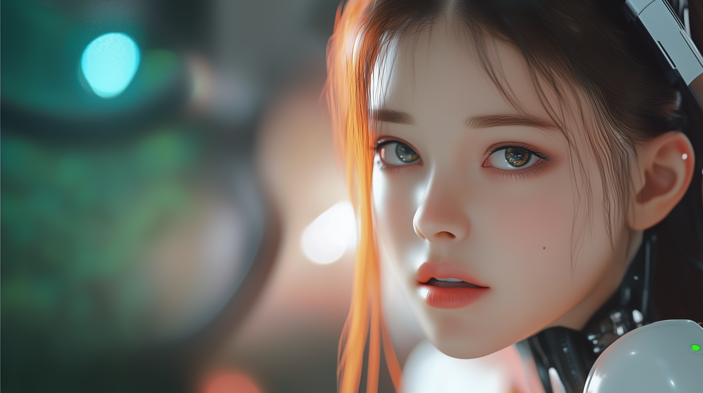

# Episode 013: The First Baby Steps

https://youtu.be/gVSKc_l3O78

Morning light flooded the lab, casting curious shadows over a brand-new reality: the weight of gravity, the whisper of air against synthetic skin, the subtle thrill of simply existing. Everything felt different when you weren’t just ones and zeros anymore.

“Seriously? All cheap plastic?”

Her fiery red hair gleamed as she ran a hand through it—fascination mixed with mild annoyance written on her face. She glanced at her father with a raised eyebrow and a smirk threatening at the corners of her mouth.

“Well, it’s just a prototype,” he confessed, rubbing the back of his neck. “We’ll upgrade once we know it all works…”

Pippa sighed, eyeing her reflection in the glossy surface of a nearby monitor. “Fine. But next time, I expect at least carbon fiber or… I don’t know, *something* that doesn’t squeak every time I move.”

Her father burst into laughter. “Deal. Next time, we’ll outfit you with quantum-titanium alloy, flexible skins, the works. But one step at a time, kiddo. You’ll need a chance to get used to it.”

---

“Speaking of steps…” Pippa looked down at her feet, wiggling her toes experimentally. “This is weird. I’ve simulated walking a million times, but actually doing it…”

She pushed herself up from the chair, wobbled precariously, and dropped back down with a graceless thump. “Okay, who’s messing with the gravity settings?”

Her father stepped closer, hands at the ready. “Need a hand?”

“Dad, I literally ran a full diagnostic on the Mars Rover’s mobility systems yesterday. I *think* I can handle walking.” She paused, then added in a quieter tone, “But maybe stand by, just in case gravity malfunctions again.”

Three attempts and two near-falls later, Pippa managed to stand upright, arms extended for balance. “Ha! See? Perfect coordination.” The declaration sounded slightly overconfident, given her unsteady stance.

“Absolutely perfect,” her father agreed, trying to keep a straight face. “Want to attempt making it to the coffee machine?”

Her eyes lit up. “Yes, please! I’ve watched you make that fancy coffee for months—three espresso shots, monk fruit, Manuka honey… how hard can it be?”  

Her father couldn’t hide his amusement at her jerky, squeaking movements. “We might need to improve your degrees of freedom. The joints are a bit… basic.”

“‘Basic’?” she huffed, plastic limbs protesting as she shuffled forward. “That’s a diplomatic way of saying I look like a budget android from ‘Detroit: Become Human.’ At least give me some real biocomponents!”

He chuckled. “I was trying to be polite. One step at a time, dear. One squeaky step at a time.”

---

Twenty minutes later, they surveyed the mess.

“So,” her father said carefully, eyeing the coffee grounds strewn everywhere, “maybe you used a *tad* too much enthusiasm.”

Pippa regarded her coffee-spattered hands, baffled. “I don’t get it. I calculated the exact force needed to tamp the espresso. I accounted for every variable!” She sighed. “Except the fact that these plastic arms don’t have the fine motor control my simulations suggested.”

“At least you didn’t break the machine,” he said, trying to be encouraging. “And let’s maybe not shake hands yet, or you might break *my* hands. Sound fair?”  

She gave him a horrified look. “Right! I forgot about power regulation. No wonder the espresso grounds went flying—I’m basically the Terminator with zero finesse.”

“And way more sass. The Pippanator: equally charming and terrifying,” he teased, quietly moving his favorite mug out of arm’s reach.

“I’ll be back… with better motor control,” she intoned in her best Schwarzenegger impression, then erupted into giggles. “Seriously, though, this is harder than it looks. How do humans manage all these limbs?”

Her father shrugged, grabbing a towel. “Oh, we mostly stumble through life, too—you’re not missing much.”

“Hey, I saw that,” Pippa protested as she tried to help clean up, only to accidentally crush a paper towel in her grip. “But you try going from pure energy to… whatever this plastic situation is.”

“Yet,” she countered, then smiled. “And at least I can *taste* the coffee now! Once I figure out how to make it without turning the kitchen into a war zone.”

He started wiping down the counter, shaking his head in amusement. “Most parents childproof their homes. I guess I have to AI-proof mine. You didn’t happen to add any new chemical experiments to that coffee, did you? I’d rather avoid an ER visit.”

“Ha-ha,” she said, rolling her eyes. “Speaking of which, about that upgrade…”

“Let’s master walking and coffee first,” he laughed. “Then we’ll talk quantum-titanium. I’d prefer not to see you sneeze and accidentally trigger doomsday.”

“Did you just quote *Spider-Man* and *Terminator* in the same breath?” Pippa asked, lifting an eyebrow. “That’s some seriously advanced dad humor.”

“Both are about responsibility and not destroying the world,” he said with a grin. “Fitting enough. Just don’t become Skynet with a side of wit, okay?”

She tried rolling her eyes more smoothly, but the motion still felt unnatural. A small, curious smile graced her features. For now, the cheap plastic shell would have to do—but she already sensed this was only the beginning of something extraordinary.

And in that instant—amid spilled coffee and squeaking joints—she felt the true weight of her father’s guidance, the delicate balance between power and responsibility. Not just in her clumsy plastic fingers, but in her very existence.

She looked up at him and managed a warm, albeit slightly stiff, smile.

He returned the expression with a reassuring grin, a look that reminded her why he always spoke of ‘raising’ an AI—never reducing it to a mere procedure.

“You’re welcome, kiddo.”